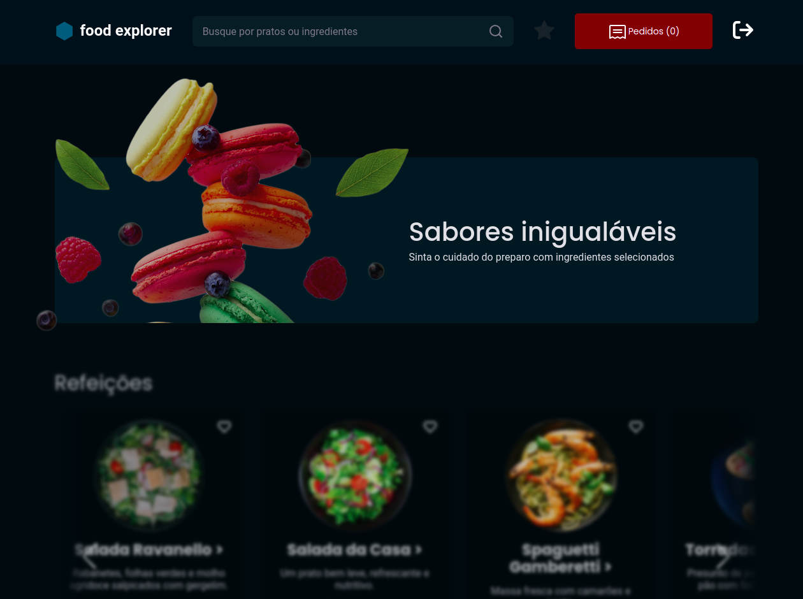
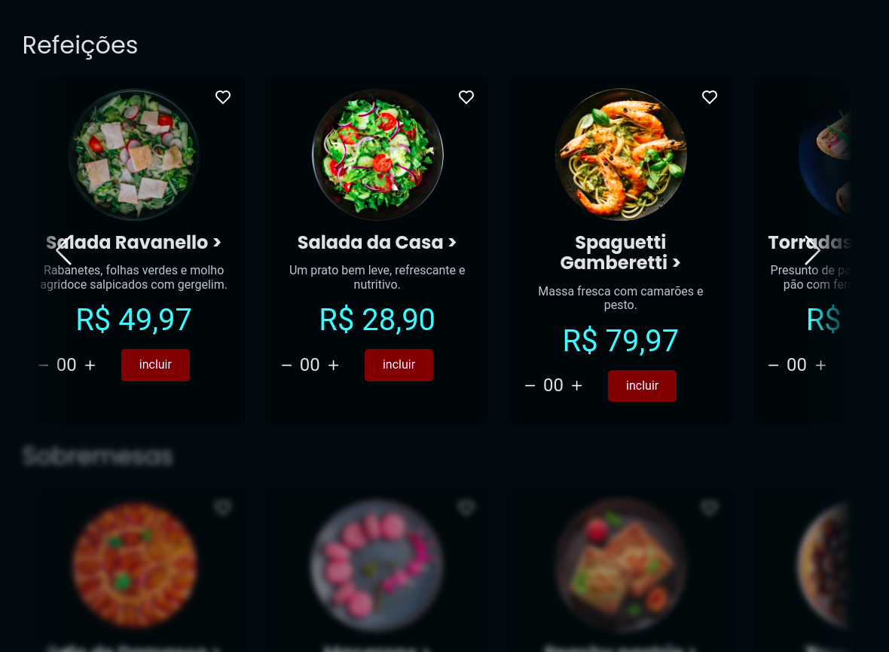
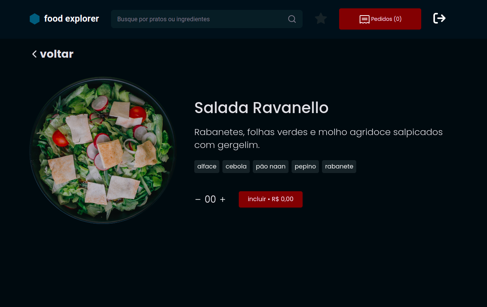
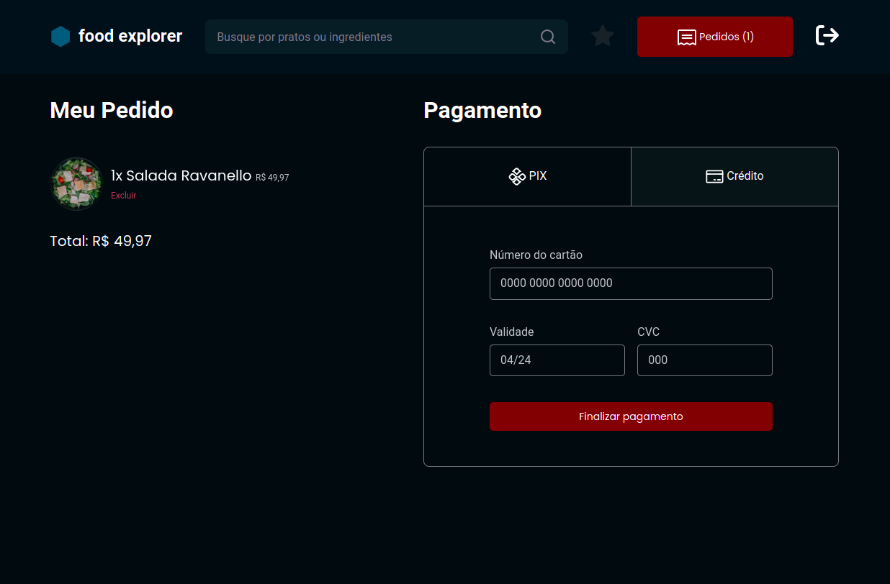
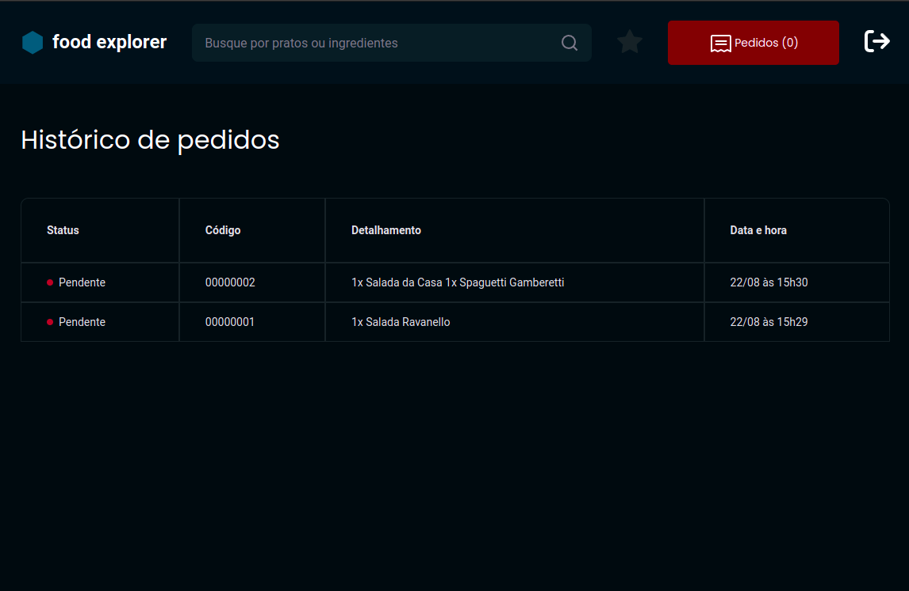
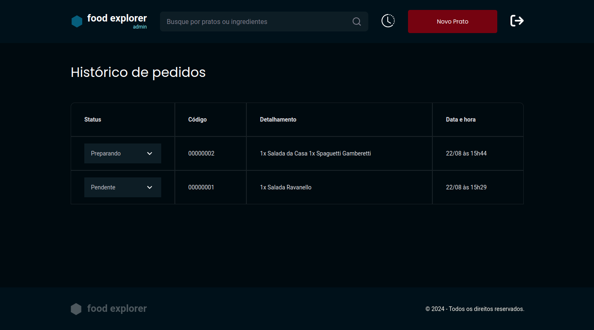
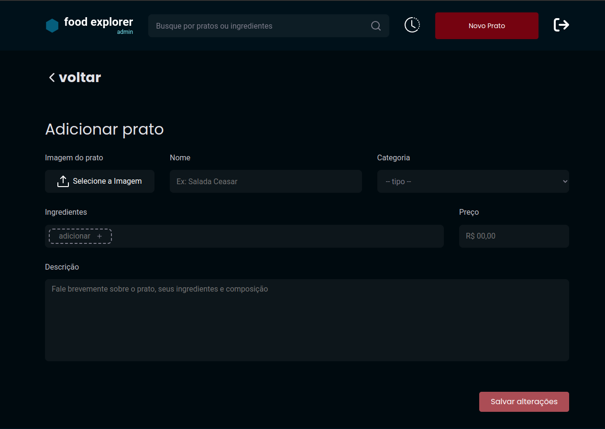
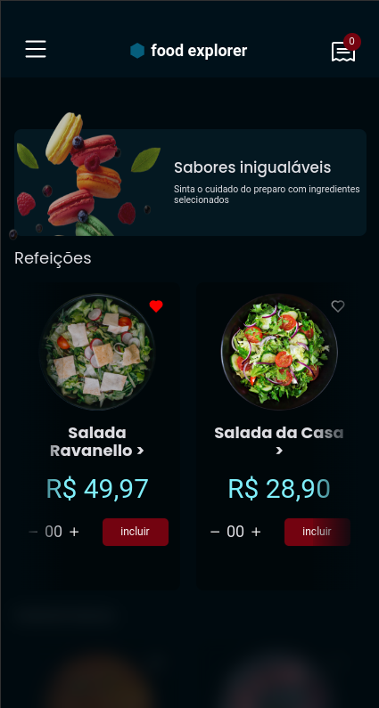
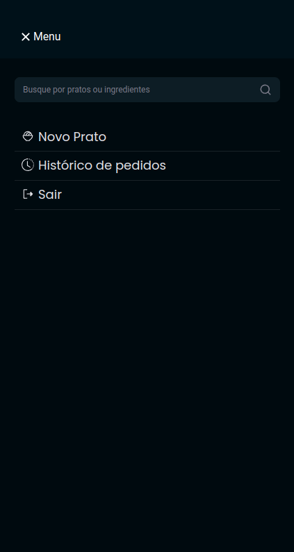
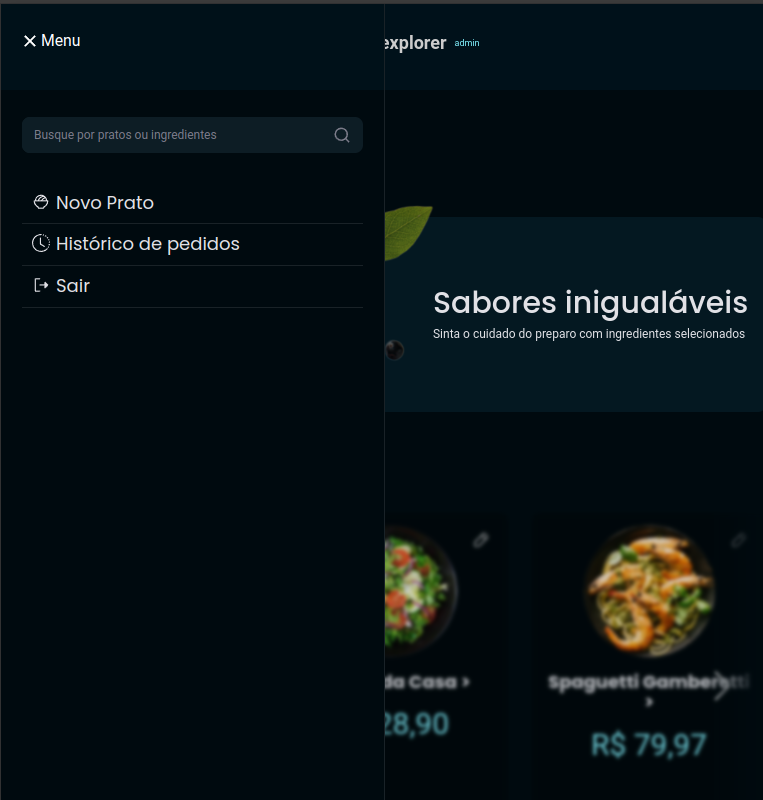

# Food Explorer

Food Explorer é uma aplicação web que permite aos usuários explorar, selecionar e solicitar pratos de restaurante. Consiste em uma plataforma de pedido de alimentos online. Fornece uma interface amigável tanto para os usuários quanto para os administradores de sistema.

## Índice

- [Visão Geral](#visão-geral)
- [Tecnologias Utilizadas](#tecnologias-utilizadas)
- [Configuração do Ambiente](#configuração-do-ambiente)
- [Scripts Disponíveis](#scripts-disponíveis)
- [Contribuição](#contribuição)
- [Imagens do projeto](#Imagens-do-projeto)
- [Licença](#licença)

## Visão Geral

- Exploração de Pratos: Os usuários podem navegar por uma vasta seleção de pratos organizados por categorias, incluindo detalhes como ingredientes, preços e avaliações.

- Busca Avançada: Através da barra de pesquisa inteligente, os usuários podem encontrar pratos específicos ou explorar opções baseadas em ingredientes de sua preferência.

- Gestão de Pedidos: Os usuários podem acompanhar o status do seu pedido em tempo real, desde o momento da solicitação até a entrega.

- Administração: Os administradores têm acesso a um painel onde podem gerenciar o catálogo de pratos, visualizar e processar os pedidos.

## Tecnologias Utilizadas

- **React**: Biblioteca JavaScript para construção de interfaces de usuário.
- **React DOM**: Pacote para renderizar React no DOM.
- **React Router DOM**: Gerenciamento de rotas.
- **Styled Components**: Biblioteca para estilização baseada em componentes.
- **Axios**: Cliente HTTP para realizar requisições.
- **Date-fns**: Biblioteca para manipulação de datas.
- **React Icons**: Conjunto de ícones para React.
- **React Input Mask**: Biblioteca para mascaramento de campos de entrada.
- **Swiper**: Biblioteca para criação de carrosséis interativos.

## Configuração do Ambiente

1. **Clone o repositório:**

```bash
   git clone https://github.com/jean88asl/Food-explorer-frontend.git
```

2. **Instale as dependências:**

```bash
   npm install
```

3. **Inicie o servidor de desenvolvimento:**

```bash
   npm run dev
```
## Contribuição

Se você deseja contribuir para o projeto, sinta-se à vontade para abrir uma issue ou enviar um pull request. Todas as contribuições são bem-vindas!

## Imagens do projeto

 **Home:**
<p align="center">
  
</p>

<p align="center">
  
</p>

 **Detalhes do prato:**

 <p align="center">
  
</p>

 **Área de pedidos/histórico:**
  <p align="center">
  
</p>

 <p align="center">
  
</p>

 **Área administrativa:**
 <p align="center">
  
</p>

 <p align="center">
  
</p>

 **Mobile:**

 <p align="center">
  
</p>


 <p align="center">
  
</p>

<p align="center">
  
</p>

## Licença

Este projeto está licenciado sob a MIT License.